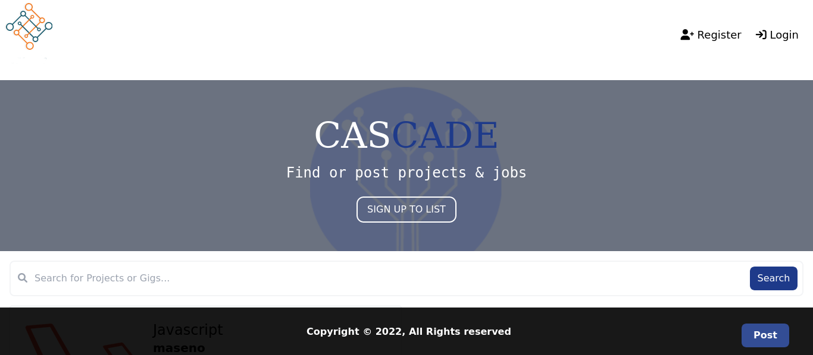
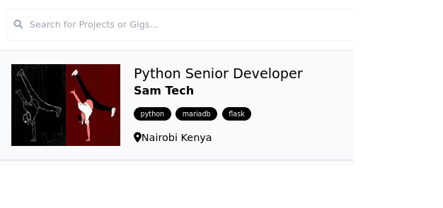
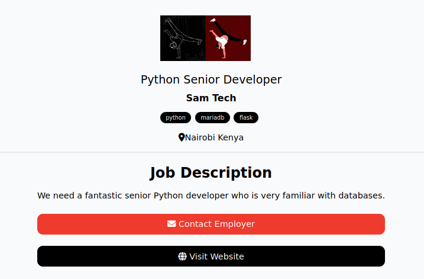
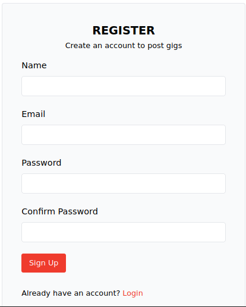
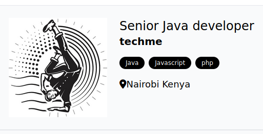

## Cascade
 
### Portfolio project:

  
 

`Front-end` `Back-end` `Portfolio project` `laravel` `php` `MySQL`

### link to the landing page:

https://cascade-53ac2.web.app

### General Info
***

This is a job/project posting web application where users are able to post developer jobs/projects, the location where in this case the job is being offered, the company name, the relevant skills or programming languages used in the project, a brief description and also upload the logo of the projects/company.

Also users are able to create accounts where they will have the privilege to access any listing that they post, delete or even edit it.

### The Story

Cascade was motivated by the desire to enable developers to experience ease in job finding and also companies in job posting. Having a simplistic approach in development and also implementation, Cascade thrives in simplicity as its core aspect.

### Getting Started

Getting started is actually very simple. Even without an account, one is able to see the listed jobs but in order for one to able to post, account creation is necessary.

### Screenshots
***

* Home Page:

  
 

* Sample of listed job:

  
 

* Inside the listing itself:

  
 

* Registration Page:

  
 

* Job/Project posting page:

  
 

* Result:

  
 

### Built With

1. Laravel blade.
2. HTML 5 & CSS 3.(Tailwind CSS employed)
3. Alpine JavaScript.
       

### Compilation & Commmands:

### Minimum Requirements

Install:

→ composer : For managing dependencies in laravel. (https://getcomposer.org/download/)

→ Laravel : This is an MVC framework with bundles, migrations, and Artisan CLI.
	        Create a new directory,move into that directory and install Laravel.

``composer create-project laravel/laravel <name of your project>``

Next Start the laravel service by running:

``php artisan serve``

Now we are good to go.

### Table of Contents
***

* app: 		This directory contains the core code of the application.

* bootstrap: 	This directory contains the application bootstrapping script.

* config: 	This directory contains configuration files of application.

* database: 	This folder contains your database migration and seeds.

* public: 	This is the application’s document root. It starts the Laravel application.
		It also contains the assets of the application like JavaScript, CSS, Images, etc.

* resources: 	This directory contains raw assets such as the LESS & Sass files,
		localization and language files, and Templates that are rendered as HTML.

* storage: 	This directory contains App storage, like file uploads etc. Framework
		storage (cache), and application-generated logs.

* test: 		This directory contains various test cases.

* vendor: 	This directory contains composer dependencies.

### Authors & Contributers:
*kabingu Sammy* - [Github](https://github.com/kabingusam) || [twitter](https://twitter.com/Kabingusammy)

### Acknowledgments 
***
Alx SE Program.
